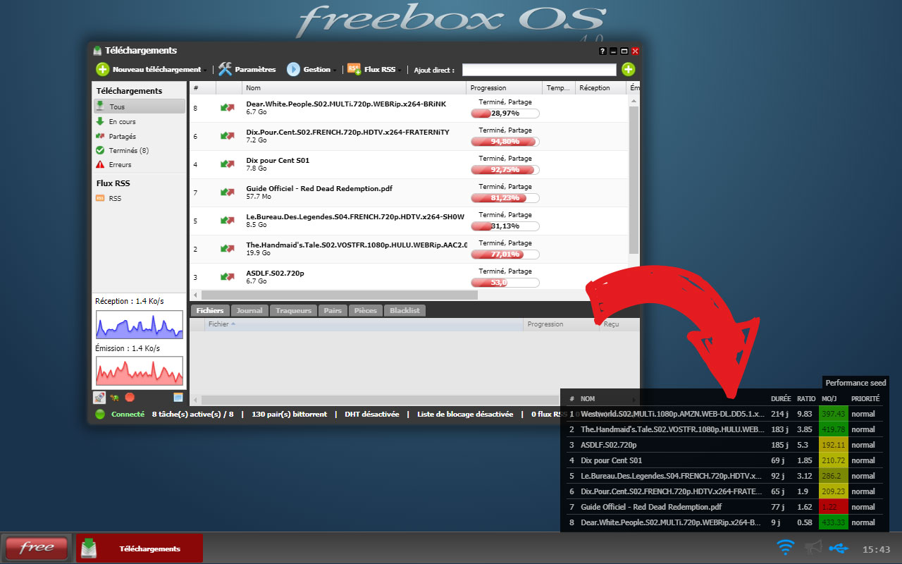
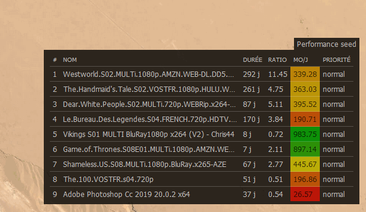

# Performance Seed Freebox [![Chrome version][badge-cws]][link-cws] [![Firefox version][badge-amo]][link-amo]

[badge-cws]: https://img.shields.io/chrome-web-store/v/edlkgcidmeflfpjmeakkhhehbocokaie.svg?label=chrome
[badge-amo]: https://img.shields.io/amo/v/performance-seed-freebox.svg?label=firefox
[link-cws]: https://chrome.google.com/webstore/detail/npmhub/edlkgcidmeflfpjmeakkhhehbocokaie 'Aller sur la page Chrome Web Store'
[link-amo]: https://addons.mozilla.org/fr/firefox/addon/performance-seed-freebox/ 'Aller sur la page Firefox add-ons'

  
  &nbsp;
  

Cette extension affiche un tableau avec l'efficacité des torrents en cours de partage (seeds) sur votre Freebox. Cela vous aide à déterminer les seeds les plus rentables pour votre ratio ;)

Le calcul utilise le temps de partage et le volume partagé du torrent pour déterminer une moyenne de partage par jour. L'échelle de couleur est relative au seed le plus performant. Seulement les torrent en seed actif sont affichés dans le tableau. Le tableau se met à jour toutes les minutes sauf si il est fermé.

 _Notification de mise à jour_

### Vie privée

Aucune information n'est récupérée par l'extension (pas de tracking, pas de meta-données, pas d'infos personnelles).
