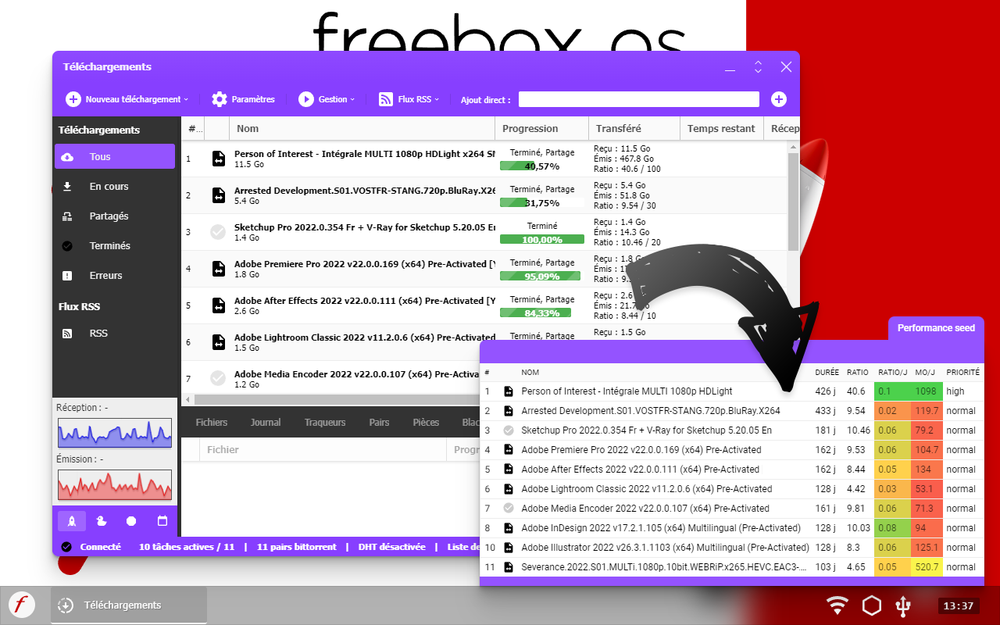

[badge-cws]: https://img.shields.io/chrome-web-store/v/edlkgcidmeflfpjmeakkhhehbocokaie.svg?label=chrome
[badge-amo]: https://img.shields.io/amo/v/performance-seed-freebox.svg?label=firefox
[link-cws]: https://chromewebstore.google.com/detail/performance-seed-freebox/edlkgcidmeflfpjmeakkhhehbocokaie 'Aller sur la page Chrome Web Store'
[link-amo]: https://addons.mozilla.org/fr/firefox/addon/performance-seed-freebox/ 'Aller sur la page Firefox add-ons'

# Performance Seed Freebox [![Chrome version][badge-cws]][link-cws] [![Firefox version][badge-amo]][link-amo]

  
  &nbsp;
  

Cette extension affiche un tableau avec l'efficacité des torrents en cours de partage (seeds) sur votre Freebox. Cela vous aide à déterminer les seeds les plus rentables pour votre ratio ;)

Les deux principales informations supplémentaires pour chaque torrent sont :

- le volume de ratio par jour (moyenne)
- le volume de données partagés par jour (moyenne)

Une échelle de couleur permet de rapidement voir les torrents les plus performants. Le tableau se met à jour toutes les 2 secondes quand il est ouvert.

### Vie privée

Aucune information n'est récupérée par l'extension (pas de tracking, pas de meta-données, pas d'infos personnelles).
